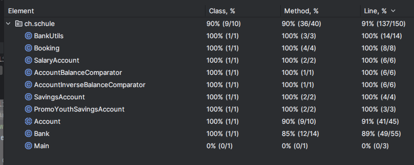

# JUnit Zusammenfassung

JUnit ist weit verbreitet und hat daher auch viel support und eine grosse community, 
die man fragen kann.
Hier sind einige der häufigsten Features von JUnit zusammen mit kurzen 
Anwendungsfällen und Beispielen:

## 1. Annotations
- `@Test`: Markiert eine Methode als Testmethode.
    - **Beispiel**: `@Test void testAdd() { ... }`
- `@BeforeEach`: Wird vor jeder Testmethode ausgeführt.
    - **Beispiel**: `@BeforeEach void setUp() { ... }`
- `@AfterEach`: Wird nach jeder Testmethode ausgeführt.
    - **Beispiel**: `@AfterEach void tearDown() { ... }`
- `@BeforeAll`: Wird einmal vor allen Testmethoden ausgeführt.
    - **Beispiel**: `@BeforeAll static void init() { ... }`
- `@AfterAll`: Wird einmal nach allen Testmethoden ausgeführt.
    - **Beispiel**: `@AfterAll static void cleanUp() { ... }`
- `@Disabled`: Deaktiviert eine Testmethode.
    - **Beispiel**: `@Disabled("Disabled until bug #42 is resolved") void test() { ... }`

## 2. Assertions
Assertions sind Kernbestandteile von Tests, die überprüfen, ob das Testergebnis den Erwartungen entspricht.

- `assertEquals(expected, actual)`: Überprüft, ob zwei Werte gleich sind.
- `assertNotEquals(expected, actual)`: Überprüft, ob zwei Werte nicht gleich sind.
- `assertTrue(condition)`: Überprüft, ob eine Bedingung wahr ist.
- `assertFalse(condition)`: Überprüft, ob eine Bedingung falsch ist.
- `assertThrows(exception, executable)`: Erwartet, dass eine bestimmte Ausnahme geworfen wird.
- `assertAll(executables)`: Gruppiert mehrere Assertions.
- etc.

## 3. Assumptions
Assumptions werden verwendet, um Tests unter bestimmten Bedingungen auszuführen.

- `assumeTrue(condition)`: Führt den Test nur aus, wenn die Bedingung wahr ist.
- **Beispiel**: `assumeTrue("DEV".equals(System.getenv("ENV")));`

## 4. Parameterisierte Tests
Parameterisierte Tests erlauben das Durchführen von Tests mit verschiedenen Datensätzen.

- `@ParameterizedTest`: Markiert eine Methode als parameterisierten Test.
- `@ValueSource`, `@CsvSource`, `@MethodSource`: Verschiedene Quellen für Testdaten.
- **Beispiel**: `@ParameterizedTest @ValueSource(ints = { 1, 2, 3 }) void test(int arg) { ... }`

## Referenzseite
Eine umfassende Referenz für JUnit 5 finden Sie auf der offiziellen Website: [JUnit 5 User Guide](https://junit.org/junit5/docs/current/user-guide/).

---

## Bank-Software Dokumentation

- **Software Funktionalität:**
  - Sie simuliert grundlegende Bankoperationen mit Konten und Transaktionen.
  - Durch Vererbung kann man verschiedene kontotypen erstellen.
  - Konten erstellen / verwalten verschiedener kontotypen.
  - Einzahlungen und Auszahlungen bearbeiten.
  - Kontodetails und Transaktionen Printen / anzeigen.

----

## Code coverage

